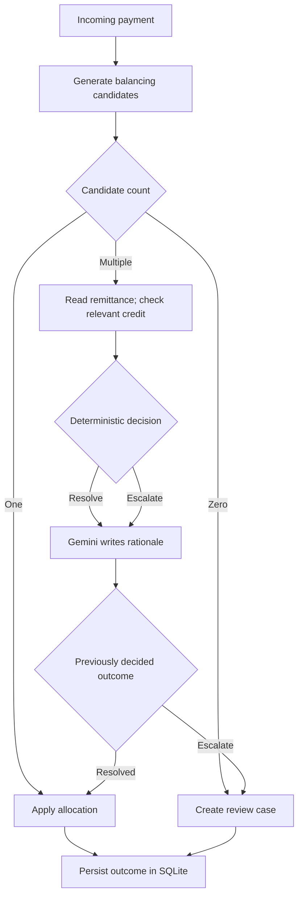
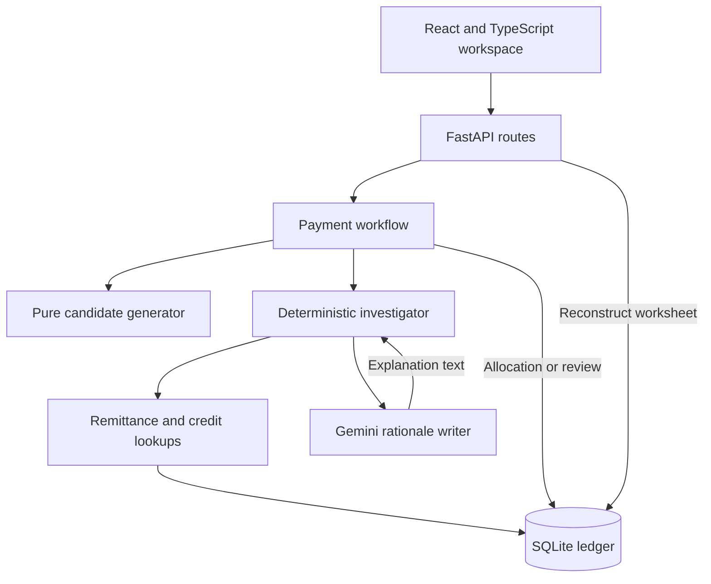
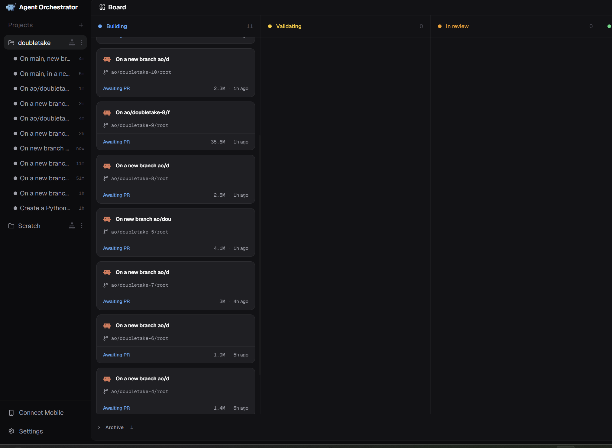

<div align="center">

# DoubleTake

### This payment matches perfectly—and closing it would still be wrong.

Evidence-based reconciliation for incoming customer payments.<br>
Compare the possibilities. Check the supporting records. Explain the outcome.

**Syndicate by Maximor · Track 2: Autonomous Office of the CFO**

### 🚀 Live Demo

- **Frontend:** [DoubleTake on Vercel](https://doubletake-sand.vercel.app/)
- **Backend API:** [DoubleTake API on Railway](https://doubletake-production.up.railway.app/)
- **API Docs:** [FastAPI Swagger Docs](https://doubletake-production.up.railway.app/docs)


[Demo walkthrough](#demo-walkthrough) · [How it works](#how-it-works) · [Evaluation](#evaluation) · [Run locally](#run-locally) · [AO build history](#built-with-ao)

</div>

---

## The project in 30 seconds

DoubleTake helps an accounts-receivable operator answer a deceptively difficult question: **which invoice did this customer actually pay?**

It enumerates exact-amount and invoice-minus-credit-note candidates. When several allocations balance, it checks remittance references and credit-note records, then either records an allocation or creates a review case with the evidence and explanation attached.

The distinguishing demo is a payment whose remittance looks convincing, but relies on a credit note the ledger says was already consumed. DoubleTake escalates that case instead of silently allocating to the other invoice that happens to match the amount.

| What to inspect | What the repository demonstrates |
| --- | --- |
| **Business workflow** | Incoming payment → candidate comparison → allocation or review case |
| **Exception handling** | Missing remittance, consumed credit, and mismatched credit-note citations |
| **Decision boundary** | Deterministic Python decides; Gemini phrases the explanation |
| **Persistence** | Stored allocations, review cases, evidence, and rationales; processed cases remain inspectable after reload |
| **Evaluation** | 13 labeled synthetic cases; 7 allocations, 6 escalations, 4 expected contradictions |
| **Verification** | 24 backend tests pass; TypeScript and Vite production build pass |
| **Build process** | AO-named development branches and merged PRs, including concrete bug fixes |

**Prototype scope:** structured synthetic records, one incoming payment at a time, and full settlement against one invoice, optionally using one linked credit note. Human review is a persisted handoff; an approval-and-resume workflow is not implemented.

## Why an amount match is not enough

Consider the actual `CUST-02` seed case:

| Record | Amount | Interpretation |
| --- | ---: | --- |
| Payment `PAY-201` | ₹1,00,000 | Money received |
| Invoice `INV-201` | ₹1,00,000 | An exact amount match |
| Invoice `INV-202` | ₹1,02,000 | A second possible invoice |
| Linked credit note `CN-201` | ₹2,000 | Makes `INV-202` balance to the same payment |

Both candidates pass arithmetic checks. Remittance `RA-201` identifies `INV-202` and `CN-201`; the credit is available. The investigator selects `INV-202`, leaving the exact-amount distractor open.

Now inspect `CUST-03`: its remittance names `INV-302` and `CN-301`, but `CN-301` is marked **consumed by `INV-999`**. DoubleTake opens a review case and sets `contradiction_found=True`. It does not fall back to the other amount-matching invoice.

These are distinct outcomes:

| Evidence state | Example | Result |
| --- | --- | --- |
| Supports the proposed allocation | Remittance and an available linked credit agree | Allocate |
| Does not establish intent | Remittance is missing | Review, without a contradiction flag |
| Conflicts with the ledger | Claimed credit was consumed or the cited credit differs from the candidate's credit | Review, with a contradiction flag |

The invoice and credit-note IDs above are synthetic fixtures, not customer records.

## Demo walkthrough

After [starting the app and seeding the database](#run-locally), open the [live overview](https://doubletake-sand.vercel.app/) or run the app locally. The overview illustration explains the concept; the payment worksheets below it run against the backend.

1. **Open `PAY-201` and choose “Process payment.”** Compare the two candidates, then inspect the remittance, credit status, selected invoice, and rationale.
2. **Open `PAY-301` and process it.** Find `CN-301`, its consumed status, and the reference to `INV-999`. The payment remains under review.
3. **Open `PAY-401` and process it.** Show why missing evidence prompts review without claiming a proven contradiction.
4. **Open `PAY-101` and process it.** Show the direct, single-candidate allocation path.
5. **Reload a processed worksheet.** The evidence and outcome remain available through the payment-detail API; no new investigation is needed.

| Customer / payment | Scenario | Expected result | Contradiction |
| --- | --- | --- | --- |
| `CUST-01` / `PAY-101` | Single ₹50,000 exact match | Allocate to `INV-101` | No |
| `CUST-02` / `PAY-201` | Ambiguity resolved by remittance and available credit | Allocate to `INV-202` | No |
| `CUST-03` / `PAY-301` | Remittance relies on consumed credit | Under review | Yes |
| `CUST-04` / `PAY-401` | Multiple candidates; no remittance | Under review | No |

Source: [four demo scenarios](doubletake/data/seed_cases/case_001.json). Reseeding resets all demo outcomes; it is not needed when merely reloading a worksheet.

## How it works

### Payment decision flow



The one-candidate branch is the prototype's direct-allocation shortcut: it bypasses investigation, including credit-status checks. The contradiction handling demonstrated here is on the multiple-candidate path. See [current boundaries](#current-boundaries) for the implications.

### Application architecture



| Component | Responsibility | Source |
| --- | --- | --- |
| Candidate generator | Decimal arithmetic; same-customer open invoices; exact or linked-credit deduction matches | [candidates.py](doubletake/app/candidates.py) |
| Investigator | Fixed evidence order, remittance matching, credit checks, and contradiction decisions | [investigator.py](doubletake/app/investigator.py) |
| Workflow | Branch on candidate count; write allocation or review; update payment and invoice status | [workflow.py](doubletake/app/workflow.py) |
| Persistence | Six SQLAlchemy models: invoice, credit note, payment, remittance, allocation, review case | [models.py](doubletake/app/models.py) |
| API | Process a payment and retrieve the stored worksheet | [main.py](doubletake/app/main.py) |
| Workspace | Overview, payment list, comparison worksheet, evidence, and outcome | [frontend pages](doubletake/frontend/src/pages) |

### What the AI does—and what decides

All invoice selection, escalation, and contradiction decisions are deterministic. The evidence order is a **fixed heuristic: remittance first, relevant credit-note status second**. It is not adaptive information-gain ranking.

For ambiguous cases, the investigator makes one Gemini request after reaching its decision. The request contains candidates, evidence, and the outcome; the model is instructed to summarize those facts in one or two sentences without inventing IDs or amounts. The current runtime model alias is `gemini-flash-lite-latest`.

The model cannot select an invoice or change the contradiction flag through its response. Its text is still generated text, not an independently verified proof. Also, the API call is synchronous and has no implemented fallback: a failed rationale request can prevent an ambiguous workflow from completing.

**AO serves a different purpose:** it orchestrated coding work during development. It is not embedded in the payment-processing runtime.

## Evaluation

**Synthetic deterministic workflow evaluation · Gemini rationale mocked · No live API calls**

The [evaluation harness](doubletake/scripts/run_eval.py) loads the four demo customers plus nine additional labeled customers into a fresh in-memory SQLite database. It executes the real workflow and compares each outcome and selected invoice with the expected labels. Expected labels are kept out of runtime ledger inputs.

| Metric | Result | Exact denominator |
| --- | ---: | --- |
| Outcome and selected-invoice correctness | **13 / 13** | All evaluated payments |
| Automatic resolution coverage | **53.8%** | 7 allocated / 13 total |
| Automatic allocation precision | **100%** | 7 correctly allocated / 7 allocated |
| Escalation correctness | **100%** | 6 correctly escalated / 6 expected escalations |
| Contradiction catch rate | **100%** | 4 flagged and escalated / 4 expected contradictions |

The script's `escalation_correctness` is recall over expected escalations, not precision over every review case. Its row-level `correct` column checks outcome and selected invoice; contradiction flags are evaluated separately.

**Interpretation:** these results establish correctness on 13 developer-authored synthetic scenarios. They do not establish production accuracy, customer time savings, calibrated confidence, or superiority over another reconciler. The harness does not evaluate Gemini's explanation quality or live-service reliability, and it includes no comparative baseline.

Evidence: [per-case CSV](doubletake/data/eval_results.csv) · [additional labeled cases](doubletake/data/seed_cases/case_002.json) · [workflow tests](doubletake/tests/test_workflow.py) · [investigator tests](doubletake/tests/test_investigator.py)

Verification against application commit [`59aef6c`](https://github.com/Prabh-84/doubletake/commit/59aef6c4bcb24aa0db9873ff1dd7a18ba6568107): **24 pytest tests passed**, the evaluation reproduced the table above, and `npm run build` passed TypeScript checking and Vite bundling. Tests emitted dependency/deprecation warnings; no live Gemini request was exercised. The verification environment used Python 3.12 and Node.js 24.

### A bug the evaluation helped expose

A remittance can reference the right invoice but the **wrong credit note**. Earlier selection logic could fall back to a different balancing credit, accepting evidence that did not support that allocation.

[PR #5](https://github.com/Prabh-84/doubletake/pull/5) added the citation-mismatch check, a regression test, and `CUST-13` to the evaluation set. The investigator now escalates that scenario with a contradiction instead of silently substituting the other credit.

A separate [persistence fix](https://github.com/Prabh-84/doubletake/commit/2d2d1e1) made investigation results available after reload. [API regression tests](doubletake/tests/test_api.py) check reconstruction for resolved, escalated, and single-candidate cases.

## Run locally

**Prerequisites:** Python 3.10+ and Node.js 20.19+ or 22.12+. Node versions here are recommended setup targets. Use two terminals: one for FastAPI and one for Vite.

The repository contains a second `doubletake/` directory. Run Python commands from that inner directory, where `app/` and `requirements.txt` live.

### 1. Clone and install the backend

```bash
git clone https://github.com/Prabh-84/doubletake.git
cd doubletake/doubletake
python -m venv .venv
```

Activate the environment using the command for your shell:

| Shell | Command |
| --- | --- |
| Windows PowerShell | `.\.venv\Scripts\Activate.ps1` |
| Windows Command Prompt | `.venv\Scripts\activate.bat` |
| macOS / Linux | `source .venv/bin/activate` |

```bash
python -m pip install -r requirements-dev.txt
```

This installs runtime dependencies plus pytest and the API-test dependencies. For runtime only, use `requirements.txt`.

### 2. Configure explanations

Create `.env` beside `requirements.txt`:

```dotenv
GEMINI_API_KEY=your_gemini_api_key
```

Use your own [Google AI Studio API key](https://aistudio.google.com/app/apikey). An Anthropic key is not used by the final runtime. Keep `.env` out of Git.

The offline tests and evaluation work without a key. Interactive ambiguous-case processing requires a working Gemini key and service access.

### 3. Seed and start FastAPI

```bash
python -m scripts.seed_db
python -m uvicorn app.main:app --reload
```

Open [API health](http://127.0.0.1:8000/health) or [interactive API docs](http://127.0.0.1:8000/docs).

The seed command **drops and recreates all ledger tables** before loading the four demo cases. It also refreshes the schema after model changes. Use it only with disposable demo data; stop other ledger activity before a reset. Startup alone uses `create_all()` and does not migrate existing columns.

### 4. Start the frontend

In the second terminal, from the repository root:

```bash
cd doubletake/frontend
npm ci
npm run dev
```

Open [DoubleTake](http://localhost:5173). Vite proxies `/api/*` to port 8000 and removes the `/api` prefix. The UI routes are `/`, `/payments`, and `/payments/:id`.

### 5. Verify and reproduce the results

From the Python project directory with the virtual environment active:

```bash
python -m pytest -q
python -m scripts.run_eval
```

Evaluation writes `data/eval_results.csv`; it does not reset the demo ledger. `case_002.json` uses a grouped evaluation format, so load it through the evaluation harness rather than the flat-format demo seeder.

From the frontend directory:

```bash
npm run build
```

### Deployment configuration

The current deployed prototype uses:

| Deployment | URL |
| --- | --- |
| **Frontend** | [https://doubletake-sand.vercel.app/](https://doubletake-sand.vercel.app/) |
| **Backend** | [https://doubletake-production.up.railway.app/](https://doubletake-production.up.railway.app/) |
| **API Docs** | [https://doubletake-production.up.railway.app/docs](https://doubletake-production.up.railway.app/docs) |

| Setting | Purpose |
| --- | --- |
| Backend project root | `doubletake/`, containing the [Procfile](doubletake/Procfile) |
| `GEMINI_API_KEY` | Backend explanation generation |
| `PORT` | Production Uvicorn listener, used by the Procfile |
| `ALLOWED_ORIGIN` | Comma-separated permitted frontend origins; defaults to `http://localhost:5173` |
| `VITE_API_BASE` | Backend base URL supplied when building the frontend; defaults to `/api` |

See the [frontend environment example](doubletake/frontend/.env.production.example). Vite's development proxy is not part of the static production build: configure `VITE_API_BASE` or provide a production reverse proxy. Static hosting must route client-side paths back to `index.html`. Persist the backend's `data/` directory if ledger state must survive a deployment.

## API reference

Paths below are backend paths; the local frontend uses its `/api` proxy prefix.

| Method | Endpoint | Behavior |
| --- | --- | --- |
| `GET` | `/health` | Returns `{"status":"ok"}` |
| `POST` | `/seed` | Drops/recreates tables and reloads the four demo customers |
| `GET` | `/payments` | Lists payments, amounts, customers, and statuses |
| `GET` | `/payments/{payment_id}` | Returns payment plus processed candidates, allocation or review, and evidence |
| `POST` | `/payments/{payment_id}/process` | Runs the workflow and persists its result |

Processing returns `outcome: allocated` or `under_review`; the investigator and evaluation use `resolved` or `escalate`. A missing payment returns HTTP 404. Before processing, the payment-detail response has no evaluated candidates.

## Built with AO



*Team-provided AO workspace capture: the Building column shows 11 tasks at the time of capture, with one item in Archive. These are board counts at that moment, not a verified total of completed sessions. Individual cards show their worktree branches; the merged PRs below establish the resulting implementation history.*

Development is traceable through focused AO-named branches and merged pull requests:

| Build increment | Repository evidence |
| --- | --- |
| Backend scaffold and ledger contract | [PR #1](https://github.com/Prabh-84/doubletake/pull/1) |
| Pure candidate generation | [PR #2](https://github.com/Prabh-84/doubletake/pull/2) |
| Evidence investigation and contradiction semantics | [PR #3](https://github.com/Prabh-84/doubletake/pull/3) |
| End-to-end payment workflow | [PR #4](https://github.com/Prabh-84/doubletake/pull/4) |
| Evaluation and credit-citation regression fix | [PR #5](https://github.com/Prabh-84/doubletake/pull/5) |
| Frontend and persisted worksheet reconstruction | [PR #6](https://github.com/Prabh-84/doubletake/pull/6) |
| Overview landing page | [PR #8](https://github.com/Prabh-84/doubletake/pull/8) |
| Setup polish and deployment configuration | [PR #9](https://github.com/Prabh-84/doubletake/pull/9), [PR #10](https://github.com/Prabh-84/doubletake/pull/10) |

These links show implementation history alongside the AO workspace screenshot. The submission video should also show the dashboard and actual session count; PR counts are not session counts.

## Current boundaries

| Boundary | Current behavior / next engineering step |
| --- | --- |
| **Validation coverage** | Single-candidate allocations bypass investigation. Apply credit and evidence checks consistently before extending beyond the demo. The investigator currently treats any credit status other than `consumed` as resolvable; unknown/missing status should instead fail closed. |
| **Credit lifecycle** | Applying an allocation marks the invoice paid and payment allocated; it does not consume the associated credit note. Atomic credit consumption is a next step. |
| **Repeated requests** | There is no implemented idempotent replay or concurrency guard. Process each payment once per seed; do not interpret fixed allocation IDs as an idempotency guarantee. |
| **Human review** | Cases are persisted and displayed as pending. Reviewer approval, rejection, and workflow resumption are not exposed. |
| **Explanation availability** | Gemini is a live dependency for ambiguous cases; fallback text and bounded failure handling remain to be added. |
| **Evidence history** | Evidence is stored, but the log is not immutable. Resolved candidate sets are reconstructed from current ledger rows, not versioned snapshots. |
| **Scope and deployment** | Synthetic, structured, full-settlement inputs; no multi-currency, partial payment, OCR, bank integration, authentication, or production access controls. The reset endpoint is intentionally destructive for the demo. |

## Repository guide

| Location | Contents |
| --- | --- |
| [`doubletake/app/`](doubletake/app) | API, schemas, ledger models, candidate generation, investigation, workflow |
| [`doubletake/frontend/`](doubletake/frontend) | React 18, TypeScript, Vite 5, Tailwind CSS, and React Router |
| [`doubletake/scripts/`](doubletake/scripts) | Demo seeding and offline evaluation |
| [`doubletake/tests/`](doubletake/tests) | Candidate, investigator, workflow, and API regression tests |
| [`doubletake/data/`](doubletake/data) | Synthetic seed cases and committed evaluation output |

## Team

**Anika Soni · Prabhjot Singh**

Built for **Syndicate by Maximor**, Track 2: **Autonomous Office of the CFO**.
